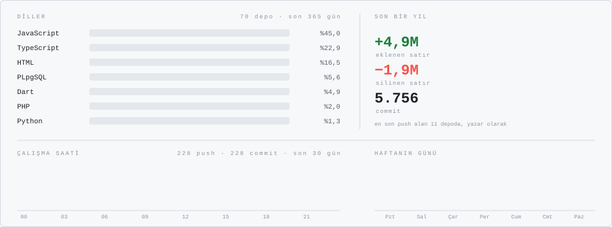
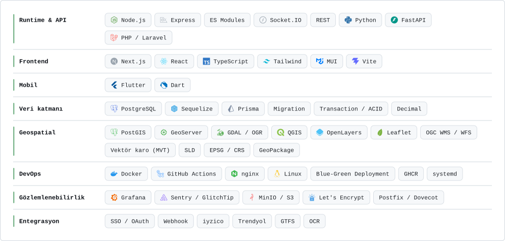
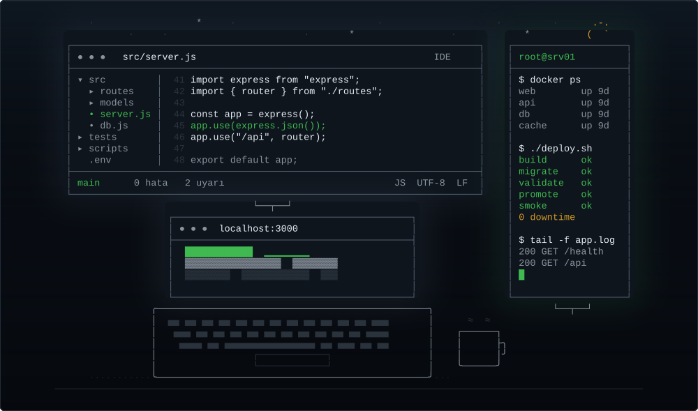
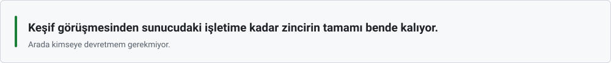
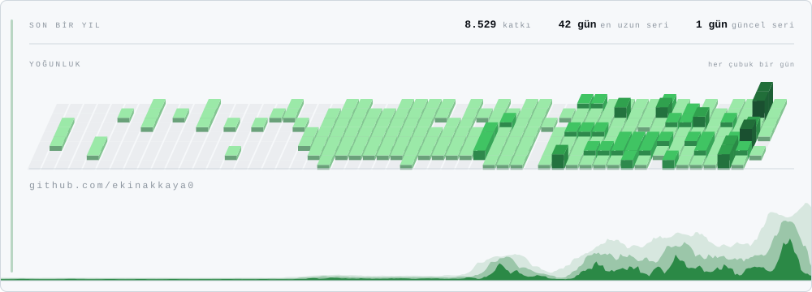

<picture>
  <source media="(prefers-color-scheme: dark)" srcset="assets/console-dark.svg" />
  
</picture>

<a href="https://www.linkedin.com/in/ekin-dogucan-akkaya/"><picture><source media="(prefers-color-scheme: dark)" srcset="assets/badge-linkedin-dark.svg" /></picture></a>
<a href="mailto:ekinakkaya0@hotmail.com"><picture><source media="(prefers-color-scheme: dark)" srcset="assets/badge-mail-dark.svg" /></picture></a>
<picture><source media="(prefers-color-scheme: dark)" srcset="assets/badge-views-dark.svg" /></picture>

<!-- Sayaç ancak ziyaretçi komarev görselini çektiğinde artar; rozetteki sayı
     her gün bir GitHub Action ile buradan okunup gömülüyor. -->

<picture>
  <source media="(prefers-color-scheme: dark)" srcset="assets/data-dark.svg" />
  
</picture>

<picture>
  <source media="(prefers-color-scheme: dark)" srcset="assets/rule-a-dark.svg" />
  
</picture>

## <picture><source media="(prefers-color-scheme: dark)" srcset="assets/h-yigin-dark.svg" /></picture>

<picture>
  <source media="(prefers-color-scheme: dark)" srcset="assets/stackband-dark.svg" />
  
</picture>

<picture>
  <source media="(prefers-color-scheme: dark)" srcset="assets/stack-dark.svg" />
  
</picture>

<picture>
  <source media="(prefers-color-scheme: dark)" srcset="assets/rule-b-dark.svg" />
  
</picture>

<picture>
  <source media="(prefers-color-scheme: dark)" srcset="assets/rule-a-dark.svg" />
  
</picture>

## <picture><source media="(prefers-color-scheme: dark)" srcset="assets/marker-dark.svg" /></picture> Kısaca

<picture>
  <source media="(prefers-color-scheme: dark)" srcset="assets/quote-dark.svg" />
  
</picture>

Yazılım işlerini uçtan uca alıyorum: keşif görüşmesinden fizibiliteye, mimariden arayüz
tasarımına, backend ve mobil geliştirmeden sunucuda yayına ve sonrasındaki işletime kadar.

En büyük işim belediyeler için yazdığım multi-tenant yönetim platformu: tek kod tabanı,
kurum başına ayrı veritabanı, 200'ün üzerinde backend modülü ve 43 panel modülü. Ama iş
oradan ibaret değil. Tarımsal üretici platformu, fabrikada CNC makine ve stok takibi,
tekstilde CRM/ERP ile pazaryeri ve ödeme entegrasyonu, restoran işletim sistemi ve dört
ayrı Flutter uygulaması da aynı elden çıktı.

### Çalıştığım alanlar

<picture>
  <source media="(prefers-color-scheme: dark)" srcset="assets/sectors-dark.svg" />
  
</picture>

<picture>
  <source media="(prefers-color-scheme: dark)" srcset="assets/rule-b-dark.svg" />
  
</picture>

## <picture><source media="(prefers-color-scheme: dark)" srcset="assets/h-uctan-uca-dark.svg" /></picture>

<picture>
  <source media="(prefers-color-scheme: dark)" srcset="assets/stages-dark.svg" />
  
</picture>

<picture>
  <source media="(prefers-color-scheme: dark)" srcset="assets/rule-a-dark.svg" />
  
</picture>

## <picture><source media="(prefers-color-scheme: dark)" srcset="assets/h-derinlik-dark.svg" /></picture>

Katman başına, gerçekten uğraştığım türden sorunlar:

| Katman | |
|:--|:--|
| <picture><source media="(prefers-color-scheme: dark)" srcset="assets/marker-dark.svg" /></picture> **Reverse proxy** | Blue-green deployment'ta nginx upstream'ini devretmek. Tek dosya olarak bind-mount edilmiş bir config'in konteynere hiç inmemesi (stale inode); `nginx -s reload` bunu kurtarmıyor, süreci HUP'lamak gerekiyor. |
| <picture><source media="(prefers-color-scheme: dark)" srcset="assets/marker-dark.svg" /></picture> **PostgreSQL** | Tenant rollerinin grant kaybından sonra gelen `permission denied for table`. `pg_restore`'un dolu bir şemaya append edip kayıtları ikiye katlaması. Migration'ın bütün aktif tenant'lara sırayla uygulanması. |
| <picture><source media="(prefers-color-scheme: dark)" srcset="assets/marker-dark.svg" /></picture> **Geospatial** | Yanlış etiketlenmiş EPSG tanımları ve CAD kaynaklı koordinat kayması. `gpkg_extensions` tablosu olmadan GeoServer'ın GeoPackage katmanını hiç görmemesi. SLD ile referans yazılıma piksel düzeyinde renk eşleme, MVT cache'inin sunucuda pişirilmesi. |
| <picture><source media="(prefers-color-scheme: dark)" srcset="assets/marker-dark.svg" /></picture> **Uygulama** | Kilitsiz seri numarası üretiminde race condition. Alan adı whitelist'te olmadığı için API mapper'ının payload'u sessizce düşürmesi. Mali hesapta floating point'in yasak olduğu yerler. |
| <picture><source media="(prefers-color-scheme: dark)" srcset="assets/marker-dark.svg" /></picture> **Mobil** | OCR başarısız olunca e-Devlet doğrulamasının kırılması ve başvuru akışının komple durması. Upload'ın 413 dönmesi çünkü isteği alan vhost'ta `client_max_body_size` tanımlı değil. |
| <picture><source media="(prefers-color-scheme: dark)" srcset="assets/marker-dark.svg" /></picture> **Sistem** | 30 GB'a dayanan bir Next.js build'i için swap açmak. Self-hosted runner'ların topluca deregister olması. systemd unit'leri, disk baskısı, arşivleme. |
| <picture><source media="(prefers-color-scheme: dark)" srcset="assets/marker-dark.svg" /></picture> **Ağ ve sertifika** | Postfix SNI map'inin sertifika yenilemesinden sonra bayat kalması; `postmap -F` olmadan çözülmüyor. Birbirini ezen iki ayrı certbot ağacı. |
| <picture><source media="(prefers-color-scheme: dark)" srcset="assets/marker-dark.svg" /></picture> **Olay müdahalesi** | Ele geçirilmiş bir sitede forensic çıkarmak. Üretim veritabanlarını yedekten ayağa kaldırmak ve nedeni ortadan kaldıran düzeltmeyi hatta eklemek. |

<picture>
  <source media="(prefers-color-scheme: dark)" srcset="assets/rule-b-dark.svg" />
  
</picture>

## <picture><source media="(prefers-color-scheme: dark)" srcset="assets/h-yakindan-dark.svg" /></picture>

<b>Multi-tenant yönetim platformu</b>

Her kurum kendi PostgreSQL veritabanında duruyor, global yapılandırma ayrı bir master
veritabanında. İstek başlığındaki tenant kimliği bir middleware'de çözülüyor; connection,
modeller ve permission'lar oradan üretiliyor. Yeni bir kurum eklemek yeni bir sürüm değil,
yeni bir kayıt.

Modüllerin tamamı aynı iskelet üzerinde: model, controller, route. RBAC sayfa bazında
read/create/update/delete. Menü ağacı veritabanından üretiliyor ve menü, permission, route
tek bir slug üzerinden hizalı duruyor.

Mali hesaplar `Decimal` ile, birden fazla tabloya dokunan iş tek transaction içinde.
Otomatik şema senkronizasyonu kapalı; her değişiklik versiyonlanmış bir migration ve aktif
tenant'ların hepsine sırayla uygulanıyor. Denetim kanıtı olabilecek kayıt otomatik
silinmiyor, arşivleniyor.

<b>Geospatial veri hattı</b>

CAD ortamında üretilmiş 1/1000 imar planlarını GeoPackage'a çevirip CRS ve karakter
kodlaması sorunlarını düzelttikten sonra PostGIS'e taşıdım. Oradan tarayıcıdaki haritaya
kadar hattın tamamı bende.

Yayın GeoServer üzerinden: WMS, WFS ve MVT. Stiller SLD ile tanımlı, stil kataloğu referans
yazılımla piksel düzeyinde kıyaslanarak eşitlendi. Nizam, ada ve yapılaşma koşulu katmanları
ham veriden türetildi.

Renge göre ayrım gereken katmanlarda stil kararını istemciden alıp sunucuda tile'a gömdüm;
ağır katmanlarda client yükü belirgin düştü. OpenLayers panelinde 3B bina görselleştirme
var, harita durumu kullanıcı bazında persist ediliyor. Ayrıca Sentinel-2 altlıkları, parsel
sorgu ekranı ve görüntüden üretilen tespitlerin kurum kayıtlarıyla aynı ekranda gösterimi.

<b>Yayın ve işletim</b>

Candidate slot hazırlanıyor, migration'lar koşuyor, validation geçerse nginx upstream'i
devrediliyor, ardından smoke test. Başarısızlıkta rollback otomatik. Elle konteyner restart
etmek yasak; o yol stale upstream ve 502 demek.

<picture>
  <source media="(prefers-color-scheme: dark)" srcset="assets/log-dark.svg" />
  
</picture>

Runner'lar kendi barındırdığım makinelerde, imajlar versiyonlanıp tag ile yayınlanıyor.
İzleme metrik toplayıcıdan alert kurallarına, oradan anlık bildirime gidiyor; error tracking
ayrı bir serviste. Hetzner, Turhost, Hostinger ve müşteri sunucusunda on-prem kurulum yaptım;
DNS, TLS ve mail tarafı da dahil.

İnternete kapalı kurumlar için USB ile taşınan bir kurulum paketi var: tek komutluk sihirbaz,
imajlar ve şema dâhil.

<b>Belediye dışı işler</b>

**Tarım / agrotech** — Üretici, kooperatif, teknik ekip, sigorta ve denetleyici kurumun aynı
süreçte rol aldığı bir platform. QR kodlu ürün izlenebilirliği, arsa-parsel sorgusu üzerinden
toprak analizi görüntüleme, karbon ve su ayak izi hesabı, soğuk zincir lojistiği. Mevzuat
dokümanlarından hesap kurallarını çıkarıp modüle çevirmek de bu işin parçasıydı.

**Sanayi** — Fabrikada stok ve sipariş takibi, siparişin baştan sona kaydı, CNC makine
durumlarının izlenmesi. Windows tarafında çalışan bir station agent'ın backend ile
haberleşmesi dahil.

**Perakende** — Tekstil firması için CRM/ERP, pazaryeri entegrasyonu ve ödeme sağlayıcı
tarafında kaybolan siparişin izinin sürülmesi.

**Gastronomi** — Restoran işletim sistemi. Flutter monorepo, garson uygulaması, kasa ve
mutfak istasyonları.

**Sivil toplum ve kurumsal** — İstihdam platformu (Flutter), kadın platformu, spor kulübü
siteleri, bilim merkezi, kamu ihale ve mevzuat modülü.

<picture>
  <source media="(prefers-color-scheme: dark)" srcset="assets/rule-a-dark.svg" />
  
</picture>

## <picture><source media="(prefers-color-scheme: dark)" srcset="assets/marker-dark.svg" /></picture> Nasıl çalışırım

<picture>
  <source media="(prefers-color-scheme: dark)" srcset="assets/principles-dark.svg" />
  
</picture>

<picture>
  <source media="(prefers-color-scheme: dark)" srcset="assets/rule-b-dark.svg" />
  
</picture>

## <picture><source media="(prefers-color-scheme: dark)" srcset="assets/marker-dark.svg" /></picture> Aktivite

<picture>
  <source media="(prefers-color-scheme: dark)" srcset="assets/ach-dark.svg" />
  
</picture>

<picture>
  <source media="(prefers-color-scheme: dark)" srcset="https://raw.githubusercontent.com/ekinakkaya0/ekinakkaya0/output/github-snake-dark.svg" />
  
</picture>

<picture>
  <source media="(prefers-color-scheme: dark)" srcset="assets/activity-dark.svg" />
  
</picture>

Yılan katkı ızgarasını dolaşıyor; altındaki panel aynı verinin günlük yoğunluğunu ve
yıla yayılmış hâlini gösteriyor. İkisi de GitHub'ın genel katkı verisinden, her gün bir
GitHub Action ile yenileniyor.

