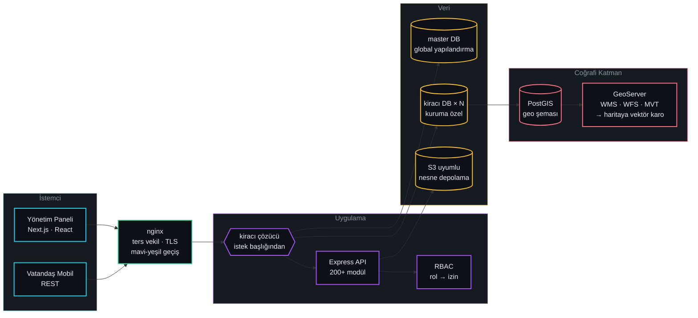

<!--
  İletişim rozeti eklemek istersen aşağıdaki satırların yorumunu kaldırıp bilgileri doldur
  ve bunları yukarıdaki rozet bloğunun içine taşı:
  
  
-->

## Kısaca

Tek bir kod tabanından, **her kuruma kendi veritabanı** verilen kamu yönetim platformları kuruyorum.
İş, vatandaşın mobil başvurusundan imar paftasının vektör karosuna ve sunucudaki mavi-yeşil
dağıtım hattına kadar uzanıyor — ürünün hem yazılımını hem de üstünde koştuğu makineyi ayakta tutuyorum.

- 🏛 &nbsp;**200'ü aşkın backend modülü** ve **43 panel modülü** tek platformda, tek kimlik ve tek izin matrisiyle
- 🗺 &nbsp;**CAD paftasından 3B vektör karoya** uzanan uçtan uca coğrafi veri hattı
- 🚀 &nbsp;**Otomatik geri almalı, sıfır kesintili dağıtım** — elle container yeniden başlatmak yasak
- 📦 &nbsp;**İnternete kapalı kuruma USB ile tek komut kurulum**, sahada uçtan uca doğrulanmış
- 🧭 &nbsp;Kaynak kodu olmayan eski kurumsal sistemleri **decompile edip parite denetimiyle** yeniden yazıyorum

> [!NOTE]
> Buradaki açık depoların çoğu eski öğrenci çalışmalarım. Güncel işlerimin tamamı kurumsal
> özel depolarda yürüdüğü için katkı sayıları bu profilin tamamını anlatmaz — anlattıklarım aşağıda.

## Ne üstünde çalışıyorum

| Alan | Ne inşa ediyorum | Çekirdek yığın |
|:--|:--|:--|
| **🏛 Platform** | Kiracı-başına-veritabanı mimarisiyle çok kiracılı yönetim sistemi; rol–izin matrisi, denetim izi, mali muhasebe ve bütçe motoru | Node.js · Express · Sequelize · PostgreSQL |
| **🗺 CBS** | İmar planı, kaçak yapı ve yapı ruhsatı katmanları; sunucuda pişirilen vektör karolar, 3B bina görselleştirme | PostGIS · GeoServer · OpenLayers · GDAL |
| **💻 Ön yüz** | 40'tan fazla müdürlük paneli, gerçek zamanlı bildirim, harita gömülü iş akışları | Next.js · React · MUI · Tailwind |
| **⚙️ Altyapı** | Mavi-yeşil dağıtım, izleme–alarm zinciri, yedekleme ve geri yükleme, TLS ve posta sunucusu otomasyonu | Docker · nginx · GitHub Actions · Linux |
| **📱 Mobil & entegrasyon** | Vatandaş mobil uygulaması için REST API, araç takip / tek oturum açma / haber akışı entegrasyonları | REST · Socket.io · FastAPI |

  
  
  
  
  

## Yığın

<table>
<tr><td valign="top" width="50%">

**Backend & Veri**

  
  
  
  
  
  
  

</td><td valign="top" width="50%">

**Ön Yüz**

  
  
  
  
  
  

</td></tr>
<tr><td valign="top">

**Coğrafi Bilgi Sistemleri**

  
  
  
  
  
  
  

</td><td valign="top">

**Altyapı & DevOps**

  
  
  
  
  
  
  
  
  

</td></tr>
<tr><td valign="top" colspan="2">

**Araçlar & Yapay Zekâ**

  
  
  
  
  
  

</td></tr>
</table>

## Mimari — kurduğum sistem tek bakışta

## Derinlemesine

<b>🏛 &nbsp;Çok kiracılı platform mimarisi</b>

Her kurum kendi PostgreSQL veritabanında yaşar; global yapılandırma ayrı bir master veritabanında durur.
İstek başlığındaki kiracı kimliği bir ara katmanda çözülür ve o isteğe ait bağlantı, modeller ve izinler oradan üretilir.

- **Modül kalıbı** — 200'ü aşkın backend modülünün tamamı aynı iskelet üzerine kurulu: model → denetleyici → rota. Yeni modül açmak şablon işi.
- **Yetkilendirme** — sayfa bazında oku/oluştur/güncelle/sil matrisi. Sol menü ağacı veritabanından üretilir; menü, izin ve rota tek bir kısa ad üzerinden hizalıdır.
- **Mali doğruluk** — para hesapları kayan noktalı sayıyla değil `Decimal` ile yapılır; birden fazla tabloya dokunan her işlem tek transaction içinde, hata hâlinde geri alınır.
- **Şema yönetimi** — otomatik şema senkronizasyonu kapalı. Her değişiklik sürümlenmiş bir migration olarak tüm aktif kiracılara sırayla uygulanır.
- **Veri saklama** — denetim kanıtı olabilecek hiçbir kayıt otomatik silinmez; arşivleme, bölümleme ve pasife alma kullanılır.

<b>🗺 &nbsp;Coğrafi bilgi sistemleri</b>

CAD ortamında üretilmiş 1/1000 imar planlarını GeoPackage'a çevirip koordinat sistemi ve karakter kodlaması
sorunlarını düzelterek PostGIS'e taşıdım; oradan da tarayıcıdaki haritaya kadar hattın tamamını kurdum.

- **Yayın** — GeoServer üzerinden WMS/WFS servisleri ve vektör karo (MVT) yayını; katman stilleri SLD ile tanımlı.
- **Kalibrasyon** — stil kataloğu, referans imar yazılımıyla piksel düzeyinde kıyaslanarak eşitlendi; nizam, ada ve yapılaşma koşulu katmanları ham veriden türetildi.
- **Performans** — renge/duruma göre ayrım gereken katmanlarda stil kararını istemciden alıp sunucu tarafında karoya gömdüm; ağır katmanlarda istemci yükü belirgin biçimde düştü. Katmanlar tembel yüklenir.
- **Deneyim** — OpenLayers tabanlı panelde 3B bina görselleştirme ve kullanıcıya özel oturum kalıcılığı: harita konumu, açık katmanlar, altlık ve filtreler bir sonraki girişte yerinde durur.
- **Yapay zekâ** — görüntüden üretilen kaçak yapı tespitlerini kurumun kendi kayıtlarıyla yan yana koyan birleşik ekran.

<b>🚀 &nbsp;Sunucu, dağıtım ve süreklilik</b>

Kod yazmakla bitmiyor: üretim ortamını da ben işletiyorum.

- **Mavi-yeşil dağıtım** — aday slot hazırlanır, migration'lar koşar, doğrulama geçerse ters vekilin yukarı akışı devredilir, ardından duman testi. Başarısızlıkta otomatik geri alma. Elle container yeniden başlatmak yasak; bypass, bayat yukarı akış ve 502 demek.
- **CI/CD** — kendi barındırdığım koşucular, sürümlenmiş imajlar ve etiketle tetiklenen yayın akışı.
- **İzleme** — metrik toplayıcı → alarm kuralları → anlık bildirim; hata takibi ayrı bir serviste, olay müdahale kılavuzları yazılı.
- **Yedekleme** — gerçek bir veri kaybı olayında üretim veritabanlarını yedekten ayağa kaldırdım, sonra da nedeni ortadan kaldıran düzeltmeyi hatta ekledim.
- **İşletim** — TLS sertifikası otomasyonu, ters vekil yapılandırması, kendi posta sunucusu (Postfix/Dovecot) ve S3 uyumlu nesne depolama.
- **Çevrimdışı kurulum** — internete kapalı kurumlar için USB ile taşınan kurulum paketi: tek komutluk sihirbaz, imajlar ve şema dâhil, sahada uçtan uca doğrulandı.

<b>🔍 &nbsp;Entegrasyon ve tersine mühendislik</b>

- **Decompile ile parite portu** — kaynak kodu bulunmayan, yalnızca derlenmiş hâlde erişilebilen kurumsal bir sistemin iş mantığını çıkardım ve modüllerini satır satır parite denetimiyle yeni platforma taşıdım (taşınır mal, bütçe, muhasebe).
- **Eski uygulama portu** — kurtarılan bir PHP/Laravel kaynağından yeni API'ye kademeli geçiş, trafik ters vekil düzeyinde bölünerek.
- **Servis entegrasyonları** — GTFS beslemeli toplu taşıma rota planlayıcı, araç takip, tek oturum açma vekilleri, haber akışı vekili.
- **Yan servisler** — görüntü işleme hattı besleyen ayrı bir FastAPI servisi ve dijital kütüphane altyapısı.

## Çalışma ilkelerim

| İlke | Ne demek |
|:--|:--|
| **Varsayma, ölç** | Üretimle ilgili her iddiayı canlı sistemden kanıtla doğrularım. "Muhtemelen öyledir" bir yanıt değildir. |
| **Veri silinmez** | Denetim kanıtı olabilecek hiçbir kayıt otomatik silinmez; çözüm arşivleme ve pasife almadır, `DELETE` değil. |
| **Geri dönüşsüz işte tek göz yetmez** | Dağıtım, migration ve veri işlemlerinde biten işi bağımsız merceklerle kırmaya çalışırım. |
| **Şema değişikliği bir migration'dır** | Otomatik şema senkronizasyonu yok; her değişiklik sürümlenmiş, izlenebilir ve geri alınabilir. |
| **Kesinti bir tasarım hatasıdır** | Hat düzgün kurulmuşsa dağıtım fark edilmez. Elle müdahale, düzeltme değil yeni bir arıza kaynağıdır. |

<!--
  AKTİVİTE BÖLÜMÜ — şu an devre dışı.

  Neden: bu depoların commit'leri ekinakkaya1@hotmail.com adresiyle atılıyor ama bu adres
  GitHub hesabına ekli/doğrulanmış olmadığı için katkılar hiçbir profile yazılmıyor.
  Ölçüm (20.08.2026): son 1 yıl 36 katkı, gizli (private) katkı 0, güncel seri 0.

  Açmak için sırasıyla:
    1) Settings -> Emails -> ekinakkaya1@hotmail.com adresini ekle ve doğrula
       (GitHub geçmiş commit'leri de geriye dönük olarak bu hesaba yazar)
    2) Settings -> Public profile -> "Include private contributions on my profile" işaretle
    3) Aşağıdaki bloğu yorumdan çıkarıp bu satırların yerine koy

## Aktivite

<picture>
  <source media="(prefers-color-scheme: dark)" srcset="https://raw.githubusercontent.com/ekinakkaya0/ekinakkaya0/output/github-snake-dark.svg" />
  <source media="(prefers-color-scheme: light)" srcset="https://raw.githubusercontent.com/ekinakkaya0/ekinakkaya0/output/github-snake.svg" />
  
</picture>

-->

