<div align="center">




<!-- İletişim rozeti eklemek istersen aşağıdakileri doldurup bu yorumdan çıkar:
<a href="mailto:ADRES@ornek.com"></a>
<a href="https://www.linkedin.com/in/KULLANICI"></a>
-->

</div>

```
╭────────────────────────────────────────────────────────────────╮
│                                                                │
│  $ whoami                                                      │
│  ekin akkaya · platform mühendisi                              │
│                                                                │
│  $ ls ~/uretim                                                 │
│  cok-kiracili-platform/     jeo-uzamsal-veri/                  │
│  sifir-kesintili-dagitim/   kapali-ag-kurulum/                 │
│                                                                │
│  $ tail -1 /var/log/deploy.log                                 │
│  promote ok · upstream devredildi · kesinti yok                │
│                                                                │
╰────────────────────────────────────────────────────────────────╯
```


## Kısaca

Belediyelerin bütün işini tek panelde toplayan bir yönetim sistemi yazıyorum. Kod tek,
her kurum kendi veritabanında duruyor. Şu an 200'ün üzerinde backend modülü ve 43 panel
modülü var.

İş uygulama katmanıyla bitmiyor. Sistemin koştuğu makineler, dağıtım hattı, izleme
zinciri, yedekler ve sertifikalar da bende. Gece bir şey patlarsa aranan kişi benim.

Son dönemde uğraştıklarım kabaca şöyle: imar paftasının CAD dosyasından çıkıp tarayıcıda
vektör karo olarak açılması, internete kapalı bir belediye sunucusuna USB'yle kurulum,
yirmi küsur kiracıya aynı anda migration, Postfix'in SNI haritasının sertifika
yenilemesinden sonra neden bayat kaldığı.

> [!NOTE]
> Buradaki açık depolar eski öğrenci çalışmalarım. Asıl iş kurumsal özel depolarda
> yürüdüğü için katkı grafiği bu profil hakkında pek bir şey söylemiyor.


## Uzmanlık

Bir konuyu bildiğimi söyleyebilmem için o konunun bozulduğu yeri görmüş olmam gerekiyor.
Aşağıdaki tablo hangi katmanda ne kadar derine indiğimi, uydurma yetkinlik listesiyle
değil kendi çözdüğüm arızalarla anlatıyor.

### Derinlik

| Katman | Elimle çözdüğüm türden sorunlar |
|:--|:--|
| **HTTP kenarı** | Mavi-yeşil geçişte ters vekilin yukarı akışını devretmek. Tek dosya olarak bind-mount edilmiş bir yapılandırmanın konteynere hiç inmemesi (bayat inode) ve `nginx -s reload` ile kurtarılamaması. |
| **PostgreSQL** | Kiracı rollerinin grant kaybından sonra gelen `permission denied for table`. `pg_restore`'un dolu bir şemaya ekleme yapıp kayıtları ikiye katlaması. Migration'ın bütün aktif kiracılara sırayla uygulanması. |
| **Jeo-uzamsal veri** | Yanlış etiketlenmiş EPSG tanımları ve CAD kaynaklı koordinat kayması. `gpkg_extensions` tablosu olmadan GeoServer'ın GeoPackage katmanını hiç görmemesi. SLD ile referans imar yazılımına piksel düzeyinde renk eşleme. |
| **Uygulama** | Kilitsiz seri numarası üretiminin yarış koşulu. Alan adı beyaz listede olmadığı için API eşleyicisinin veriyi sessizce düşürüp `notNull` hatası vermesi. Mali hesapta kayan noktalı sayının yasak olduğu yerler. |
| **Sistem** | 30 GB'a dayanan bir Next.js derlemesi için takas alanı açmak. Kendi barındırdığım koşucuların topluca kaydının düşmesi. systemd birimleri, disk baskısı, arşivleme. |
| **Posta ve TLS** | Postfix SNI haritasının sertifika yenilemesinden sonra bayat kalması ve `postmap -F` olmadan çözülmemesi. Birbirini ezen iki ayrı certbot ağacı. |

### Genişlik

Katman ayırt etmiyorum. Vatandaş mobil uygulamasının REST API'si, tek oturum açma
vekilleri, araç takip entegrasyonu, GTFS beslemeli toplu taşıma rota planlayıcı, görüntü
işleme hattını besleyen ayrı bir FastAPI servisi, S3 uyumlu nesne depolama, yedekleme ve
geri yükleme, VPN üzerinden kurum içi sunucuya bağlanıp on-prem kurulumla uğraşmak,
kapalı ağ için USB kurulum paketi hazırlamak, mali muhasebe ve bütçe motoru, rol-izin
matrisi, denetim izi, gerçek zamanlı bildirim. Hepsi aynı sistemin parçası ve hepsine
bakan aynı kişiyim.


## Teknoloji Yığını

<table>
<tr>
<td valign="middle" width="26%"><b>Çalışma Zamanı &amp; API Katmanı</b></td>
<td valign="middle">      </td>
</tr>
<tr>
<td valign="middle" width="26%"><b>Kalıcılık &amp; Şema Yönetimi</b></td>
<td valign="middle">     </td>
</tr>
<tr>
<td valign="middle" width="26%"><b>Jeo-uzamsal Veri &amp; Kartografya</b></td>
<td valign="middle">        </td>
</tr>
<tr>
<td valign="middle" width="26%"><b>İstemci &amp; Arayüz Katmanı</b></td>
<td valign="middle">      </td>
</tr>
<tr>
<td valign="middle" width="26%"><b>Dağıtım &amp; Sürüm Yönetimi</b></td>
<td valign="middle">     </td>
</tr>
<tr>
<td valign="middle" width="26%"><b>Gözlemlenebilirlik &amp; Sistem Yönetimi</b></td>
<td valign="middle">      </td>
</tr>
</table>


## Yakından

<details>
<summary><b>Çok kiracılı platform</b></summary>

Her kurum kendi PostgreSQL veritabanında duruyor, global yapılandırma ayrı bir master
veritabanında. İstek başlığındaki kiracı kimliği ara katmanda çözülüyor; bağlantı,
modeller ve izinler oradan üretiliyor. Yeni bir belediye eklemek yeni bir sürüm değil,
yeni bir kayıt.

- 200'ü aşkın modülün tamamı aynı iskelet üzerinde: model, denetleyici, rota.
- Yetki sayfa bazında oku/oluştur/güncelle/sil. Menü ağacı veritabanından üretiliyor ve
  menü, izin, rota tek bir kısa ad üzerinden hizalı duruyor.
- Para hesapları `Decimal` ile. Birden fazla tabloya dokunan iş tek transaction içinde,
  hata olursa geri alınıyor.
- Otomatik şema senkronizasyonu kapalı. Her değişiklik sürümlenmiş bir migration ve
  aktif kiracıların hepsine sırayla uygulanıyor.
- Denetim kanıtı olabilecek hiçbir kayıt otomatik silinmiyor. Yer sorunu olursa çözüm
  arşivleme ve bölümleme.

</details>

<details>
<summary><b>Jeo-uzamsal hat</b></summary>

CAD ortamında üretilmiş 1/1000 imar planlarını GeoPackage'a çevirip koordinat sistemi ve
karakter kodlaması sorunlarını düzelttikten sonra PostGIS'e taşıdım. Oradan tarayıcıdaki
haritaya kadar hattın tamamı bende.

- GeoServer üzerinden WMS/WFS servisleri ve vektör karo yayını, stiller SLD ile.
- Stil kataloğu referans imar yazılımıyla piksel düzeyinde kıyaslanarak eşitlendi. Nizam,
  ada ve yapılaşma koşulu katmanları ham veriden türetildi.
- Renge göre ayrım gereken katmanlarda stil kararını istemciden alıp sunucuda karoya
  gömdüm. Ağır katmanlarda istemci yükü belirgin düştü.
- OpenLayers panelinde 3B bina görselleştirme var. Harita konumu, açık katmanlar, altlık
  ve filtreler kullanıcı bazında saklanıyor; bir sonraki girişte yerinde duruyor.
- Görüntüden üretilen kaçak yapı tespitleri, kurumun kendi kayıtlarıyla aynı ekranda.

</details>

<details>
<summary><b>Dağıtım ve işletim</b></summary>

Aday slot hazırlanıyor, migration'lar koşuyor, doğrulama geçerse ters vekilin yukarı
akışı devrediliyor, ardından duman testi. Başarısızlıkta geri alma otomatik. Elle
konteyner yeniden başlatmak yasak; o yol bayat yukarı akış ve 502 demek.

- Kendi barındırdığım koşucular, sürümlenmiş imajlar, etiketle tetiklenen yayın.
- Metrik toplayıcıdan alarm kurallarına, oradan anlık bildirime giden bir izleme zinciri.
  Hata takibi ayrı bir serviste, olay müdahale kılavuzları yazılı.
- Gerçek bir veri kaybı olayında üretim veritabanlarını yedekten ayağa kaldırdım, sonra
  aynı şeyin tekrarını engelleyen düzeltmeyi hatta ekledim.
- Sertifika otomasyonu, ters vekil yapılandırması, posta sunucusu ve nesne depolama.
- İnternete kapalı kurumlar için USB ile taşınan kurulum paketi. Tek komutluk sihirbaz,
  imajlar ve şema dâhil, sahada uçtan uca çalıştığı görüldü.

</details>

<details>
<summary><b>Entegrasyon ve yan servisler</b></summary>

- Vatandaş mobil uygulaması için REST API ve gerçek zamanlı bildirim.
- Tek oturum açma vekilleri, araç takip entegrasyonu, haber akışı vekili.
- GTFS beslemeli toplu taşıma rota planlayıcı, üretimde kurulu.
- Görüntü işleme hattını besleyen ayrı bir FastAPI servisi ve dijital kütüphane altyapısı.

</details>


## Nasıl çalışırım

| | |
|:--|:--|
| **Varsayma, ölç** | Üretimle ilgili her iddiayı canlı sistemden kanıtla doğrularım. "Muhtemelen öyledir" bir cevap değil. |
| **Veri silinmez** | Denetim kanıtı olabilecek kayıt otomatik silinmez. Yer sıkışıyorsa arşivle, bölümle, pasife al. |
| **Tek göz yetmez** | Geri dönüşü olmayan işlerde biten işi bağımsız gözlerle kırmaya çalışırım. Bir kere yedeksiz kaybettiğin şey geri gelmiyor. |
| **Şema değişikliği migration'dır** | Otomatik senkronizasyon yok. Her değişiklik sürümlenmiş, izlenebilir, geri alınabilir. |
| **Kesinti tasarım hatasıdır** | Hat düzgün kurulmuşsa dağıtım fark edilmez. Elle müdahale düzeltme değil, yeni bir arıza kaynağı. |


<div align="center">


</div>

<!--
  AKTİVİTE BÖLÜMÜ — kapalı.

  Commit'ler ekinakkaya1@hotmail.com ile atılıyor ama bu adres GitHub hesabına doğrulanmış
  olarak ekli değil, dolayısıyla katkılar hiçbir profile yazılmıyor (ölçüm 20.08.2026:
  son 1 yıl 36 katkı, gizli katkı 0, güncel seri 0). Kartlar sıfır gösterdiği için kapalı.

  Açmak için: (1) Settings > Emails'e o adresi ekle ve doğrula, (2) Settings > Public
  profile > Include private contributions on my profile, (3) aşağıyı yorumdan çıkar.

  
  
  <picture>
    <source media="(prefers-color-scheme: dark)" srcset="https://raw.githubusercontent.com/ekinakkaya0/ekinakkaya0/output/github-snake-dark.svg" />
    
  </picture>
-->
