<div align="center">

<picture>
  <source media="(prefers-color-scheme: dark)" srcset="assets/console-dark.svg" />
  
</picture>

<a href="https://www.linkedin.com/in/ekin-dogucan-akkaya/"></a>
<a href="mailto:ekinakkaya0@hotmail.com"></a>


</div>

```
┌─ ÇALIŞTIĞIM ALANLAR ─────────────────────────────────────────┐
│                                                              │
│  kamu / belediye       multi-tenant platform, CBS, mobil     │
│  tarım / agrotech      üretici platformu, QR izlenebilirlik  │
│  sanayi / üretim       stok-sipariş takibi, CNC izleme       │
│  perakende             CRM/ERP, pazaryeri ve ödeme           │
│  turizm / gastronomi   restoran işletim sistemi, otel        │
│  spor kulüpleri        kurumsal site, üyelik, içerik         │
│  sivil toplum          istihdam ve kadın platformu           │
│  kamu ihale            mevzuat ve teklif modülü              │
│                                                              │
└──────────────────────────────────────────────────────────────┘
```

<picture>
  <source media="(prefers-color-scheme: dark)" srcset="assets/rule-a-dark.svg" />
  
</picture>

## <picture><source media="(prefers-color-scheme: dark)" srcset="assets/marker-dark.svg" /></picture> Kısaca

Yazılım işlerini uçtan uca alıyorum. Keşif görüşmesinden fizibiliteye, mimariden arayüz
tasarımına, backend ve mobil geliştirmeden sunucuda yayına ve sonrasındaki işletime kadar
zincirin tamamı bende kalıyor. Arada kimseye devretmem gerekmiyor.

En büyük işim belediyeler için yazdığım multi-tenant yönetim platformu: tek kod tabanı,
kurum başına ayrı veritabanı, 200'ün üzerinde backend modülü ve 43 panel modülü. Ama iş
oradan ibaret değil. Tarımsal üretici platformu, fabrikada CNC makine ve stok takibi,
tekstilde CRM/ERP ile pazaryeri ve ödeme entegrasyonu, restoran işletim sistemi ve dört
ayrı Flutter uygulaması da aynı elden çıktı.

<picture>
  <source media="(prefers-color-scheme: dark)" srcset="assets/rule-b-dark.svg" />
  
</picture>

## <picture><source media="(prefers-color-scheme: dark)" srcset="assets/h-uctan-uca-dark.svg" /></picture>

| Aşama | Ne yapıyorum |
|:--|:--|
| **Keşif ve kapsam** | Kurumla oturup ihtiyacı çıkarmak, mevcut sistemi incelemek, kapsamı yazıya dökmek. |
| **Fizibilite ve teklif** | Sunucu altyapısı ve maliyet hesabı, teknik ön araştırma raporu, hibe/ihale başvuru dosyası, fiyat teklifi. |
| **Mimari** | Veri modeli, API sözleşmesi, yetki matrisi, entegrasyon sınırları, monorepo mu ayrı servis mi kararı. |
| **Arayüz** | Mockup'tan üretime. Tasarım dili, responsive davranış, bileşen kütüphanesi. |
| **Geliştirme** | Backend, frontend ve mobil. Node/Express, FastAPI, Next.js, Flutter. |
| **Veri** | Şema tasarımı, migration hattı, PostGIS, raporlama ve toplu veri aktarımı. |
| **Yayın** | Docker, GitHub Actions, blue-green deployment, nginx, TLS, DNS. Hetzner, Turhost, Hostinger ve on-prem. |
| **İşletim** | İzleme ve alarm, yedekleme ve restore, olay müdahalesi, kapasite ve maliyet takibi. |
| **Belgeleme** | Kullanım kılavuzu, runbook, teknik olmayan anlatım, satış sunumu. |

<picture>
  <source media="(prefers-color-scheme: dark)" srcset="assets/rule-a-dark.svg" />
  
</picture>

## <picture><source media="(prefers-color-scheme: dark)" srcset="assets/h-derinlik-dark.svg" /></picture>

Katman başına, gerçekten uğraştığım türden sorunlar:

| Katman | |
|:--|:--|
| **Reverse proxy** | Blue-green deployment'ta nginx upstream'ini devretmek. Tek dosya olarak bind-mount edilmiş bir config'in konteynere hiç inmemesi (stale inode); `nginx -s reload` bunu kurtarmıyor, süreci HUP'lamak gerekiyor. |
| **PostgreSQL** | Tenant rollerinin grant kaybından sonra gelen `permission denied for table`. `pg_restore`'un dolu bir şemaya append edip kayıtları ikiye katlaması. Migration'ın bütün aktif tenant'lara sırayla uygulanması. |
| **Geospatial** | Yanlış etiketlenmiş EPSG tanımları ve CAD kaynaklı koordinat kayması. `gpkg_extensions` tablosu olmadan GeoServer'ın GeoPackage katmanını hiç görmemesi. SLD ile referans yazılıma piksel düzeyinde renk eşleme, MVT cache'inin sunucuda pişirilmesi. |
| **Uygulama** | Kilitsiz seri numarası üretiminde race condition. Alan adı whitelist'te olmadığı için API mapper'ının payload'u sessizce düşürmesi. Mali hesapta floating point'in yasak olduğu yerler. |
| **Mobil** | OCR başarısız olunca e-Devlet doğrulamasının kırılması ve başvuru akışının komple durması. Upload'ın 413 dönmesi çünkü isteği alan vhost'ta `client_max_body_size` tanımlı değil. |
| **Sistem** | 30 GB'a dayanan bir Next.js build'i için swap açmak. Self-hosted runner'ların topluca deregister olması. systemd unit'leri, disk baskısı, arşivleme. |
| **Ağ ve sertifika** | Postfix SNI map'inin sertifika yenilemesinden sonra bayat kalması; `postmap -F` olmadan çözülmüyor. Birbirini ezen iki ayrı certbot ağacı. |
| **Olay müdahalesi** | Ele geçirilmiş bir sitede forensic çıkarmak. Üretim veritabanlarını yedekten ayağa kaldırmak ve nedeni ortadan kaldıran düzeltmeyi hatta eklemek. |

<picture>
  <source media="(prefers-color-scheme: dark)" srcset="assets/rule-b-dark.svg" />
  
</picture>

## <picture><source media="(prefers-color-scheme: dark)" srcset="assets/h-yigin-dark.svg" /></picture>

<picture>
  <source media="(prefers-color-scheme: dark)" srcset="assets/stackband-dark.svg" />
  
</picture>

<table>
<tr>
<td valign="middle" width="17%"><b>Runtime &amp; API</b></td>
<td valign="middle">      </td>
</tr>
<tr>
<td valign="middle" width="17%"><b>Frontend</b></td>
<td valign="middle">     </td>
</tr>
<tr>
<td valign="middle" width="17%"><b>Mobil</b></td>
<td valign="middle"> </td>
</tr>
<tr>
<td valign="middle" width="17%"><b>Veri katmanı</b></td>
<td valign="middle">     </td>
</tr>
<tr>
<td valign="middle" width="17%"><b>Geospatial</b></td>
<td valign="middle">         </td>
</tr>
<tr>
<td valign="middle" width="17%"><b>DevOps</b></td>
<td valign="middle">      </td>
</tr>
<tr>
<td valign="middle" width="17%"><b>Gözlemlenebilirlik</b></td>
<td valign="middle">    </td>
</tr>
<tr>
<td valign="middle" width="17%"><b>Entegrasyon</b></td>
<td valign="middle">      </td>
</tr>
</table>

<picture>
  <source media="(prefers-color-scheme: dark)" srcset="assets/rule-a-dark.svg" />
  
</picture>

## <picture><source media="(prefers-color-scheme: dark)" srcset="assets/h-yakindan-dark.svg" /></picture>

<details>
<summary><b>Multi-tenant yönetim platformu</b></summary>

Her kurum kendi PostgreSQL veritabanında duruyor, global yapılandırma ayrı bir master
veritabanında. İstek başlığındaki tenant kimliği bir middleware'de çözülüyor; connection,
modeller ve permission'lar oradan üretiliyor. Yeni bir kurum eklemek yeni bir sürüm değil,
yeni bir kayıt.

Modüllerin tamamı aynı iskelet üzerinde: model, controller, route. RBAC sayfa bazında
read/create/update/delete. Menü ağacı veritabanından üretiliyor ve menü, permission, route
tek bir slug üzerinden hizalı duruyor.

Mali hesaplar `Decimal` ile, birden fazla tabloya dokunan iş tek transaction içinde.
Otomatik şema senkronizasyonu kapalı; her değişiklik versiyonlanmış bir migration ve aktif
tenant'ların hepsine sırayla uygulanıyor. Denetim kanıtı olabilecek kayıt otomatik
silinmiyor, arşivleniyor.

</details>

<details>
<summary><b>Geospatial veri hattı</b></summary>

CAD ortamında üretilmiş 1/1000 imar planlarını GeoPackage'a çevirip CRS ve karakter
kodlaması sorunlarını düzelttikten sonra PostGIS'e taşıdım. Oradan tarayıcıdaki haritaya
kadar hattın tamamı bende.

Yayın GeoServer üzerinden: WMS, WFS ve MVT. Stiller SLD ile tanımlı, stil kataloğu referans
yazılımla piksel düzeyinde kıyaslanarak eşitlendi. Nizam, ada ve yapılaşma koşulu katmanları
ham veriden türetildi.

Renge göre ayrım gereken katmanlarda stil kararını istemciden alıp sunucuda tile'a gömdüm;
ağır katmanlarda client yükü belirgin düştü. OpenLayers panelinde 3B bina görselleştirme
var, harita durumu kullanıcı bazında persist ediliyor. Ayrıca Sentinel-2 altlıkları, parsel
sorgu ekranı ve görüntüden üretilen tespitlerin kurum kayıtlarıyla aynı ekranda gösterimi.

</details>

<details>
<summary><b>Yayın ve işletim</b></summary>

Candidate slot hazırlanıyor, migration'lar koşuyor, validation geçerse nginx upstream'i
devrediliyor, ardından smoke test. Başarısızlıkta rollback otomatik. Elle konteyner restart
etmek yasak; o yol stale upstream ve 502 demek.

<picture>
  <source media="(prefers-color-scheme: dark)" srcset="assets/log-dark.svg" />
  
</picture>

Runner'lar kendi barındırdığım makinelerde, imajlar versiyonlanıp tag ile yayınlanıyor.
İzleme metrik toplayıcıdan alert kurallarına, oradan anlık bildirime gidiyor; error tracking
ayrı bir serviste. Hetzner, Turhost, Hostinger ve müşteri sunucusunda on-prem kurulum yaptım;
DNS, TLS ve mail tarafı da dahil.

İnternete kapalı kurumlar için USB ile taşınan bir kurulum paketi var: tek komutluk sihirbaz,
imajlar ve şema dâhil.

</details>

<details>
<summary><b>Belediye dışı işler</b></summary>

**Tarım / agrotech** — Üretici, kooperatif, teknik ekip, sigorta ve denetleyici kurumun aynı
süreçte rol aldığı bir platform. QR kodlu ürün izlenebilirliği, arsa-parsel sorgusu üzerinden
toprak analizi görüntüleme, karbon ve su ayak izi hesabı, soğuk zincir lojistiği. Mevzuat
dokümanlarından hesap kurallarını çıkarıp modüle çevirmek de bu işin parçasıydı.

**Sanayi** — Fabrikada stok ve sipariş takibi, siparişin baştan sona kaydı, CNC makine
durumlarının izlenmesi. Windows tarafında çalışan bir station agent'ın backend ile
haberleşmesi dahil.

**Perakende** — Tekstil firması için CRM/ERP, pazaryeri entegrasyonu ve ödeme sağlayıcı
tarafında kaybolan siparişin izinin sürülmesi.

**Gastronomi** — Restoran işletim sistemi. Flutter monorepo, garson uygulaması, kasa ve
mutfak istasyonları.

**Sivil toplum ve kurumsal** — İstihdam platformu (Flutter), kadın platformu, spor kulübü
siteleri, bilim merkezi, kamu ihale ve mevzuat modülü.

</details>

<picture>
  <source media="(prefers-color-scheme: dark)" srcset="assets/rule-b-dark.svg" />
  
</picture>

## <picture><source media="(prefers-color-scheme: dark)" srcset="assets/marker-dark.svg" /></picture> Nasıl çalışırım

Üretimle ilgili bir şey iddia etmeden önce ölçerim; "muhtemelen öyledir" bir cevap değil.
Denetim kanıtı olabilecek kaydı silmem, arşivlerim. Şema değişikliği elle değil migration
ile gider. Geri dönüşü olmayan işlerde tek gözle yetinmem, biteni bağımsız gözlerle kırmaya
çalışırım. Deployment'ın fark edilmesi gerekmiyor; fark ediliyorsa hatta bir sorun var.

<picture>
  <source media="(prefers-color-scheme: dark)" srcset="assets/rule-a-dark.svg" />
  
</picture>

<picture>
  <source media="(prefers-color-scheme: dark)" srcset="assets/footer-dark.svg" />
  
</picture>

<sub>Buradaki açık depolar eski öğrenci çalışmalarım. Güncel iş kurumsal özel depolarda
yürüdüğü için katkı grafiği bu profil hakkında bir şey söylemiyor.</sub>

<!--
  AKTİVİTE BÖLÜMÜ — kapalı. Commit'ler ekinakkaya1@hotmail.com ile atılıyor ama bu adres
  GitHub hesabına doğrulanmış olarak ekli değil, dolayısıyla katkılar hiçbir profile
  yazılmıyor (ölçüm 20.08.2026: son 1 yıl 36 katkı, gizli katkı 0, güncel seri 0).
  Açmak için: (1) Settings > Emails'e o adresi ekle ve doğrula, (2) Settings > Public
  profile > Include private contributions on my profile, (3) yılan/seri kartlarını ekle.
-->
