<div align="center">

<picture>
  <source media="(prefers-color-scheme: dark)" srcset="assets/sheet-dark.svg" />
  
</picture>


<!-- iletişim rozeti: adresi doldurup yorumdan çıkar
<a href="mailto:ADRES@ornek.com"></a>
<a href="https://www.linkedin.com/in/KULLANICI"></a>
-->

</div>

```
┌─ LEJANT ─────────────────────────────────────────────────────────┐
│                                                                  │
│  ━━━━━   platform        200+ modül, 43 panel, tek kod tabanı    │
│  ─────   jeo-uzamsal     CAD → PostGIS → GeoServer → tarayıcı    │
│  ┄┄┄┄┄   dağıtım         mavi-yeşil geçiş, otomatik geri alma    │
│  ·  ·    entegrasyon     mobil API, SSO, GTFS, görüntü işleme    │
│                                                                  │
└──────────────────────────────────────────────────────────────────┘
```

<picture>
  <source media="(prefers-color-scheme: dark)" srcset="assets/rule-dark.svg" />
  
</picture>

## Kısaca

Belediyeler için çok kiracılı bir yönetim sistemi yazıyorum. Tek kod tabanı, kurum başına
ayrı veritabanı. Bugün 200'ün üzerinde backend modülü, 43 panel modülü ve 4800 civarı
backend testi var.

İş uygulama katmanında bitmiyor. Sistemin koştuğu makineler, dağıtım hattı, izleme,
yedekler ve sertifikalar da bende.

Son dönemde uğraştıklarım: imar paftasının CAD dosyasından çıkıp tarayıcıda vektör karo
olarak açılması, internete kapalı bir sunucuya USB'yle kurulum, yirmi küsur kiracıya aynı
anda migration, Postfix'in SNI haritasının sertifika yenilemesinden sonra bayat kalması.

<picture>
  <source media="(prefers-color-scheme: dark)" srcset="assets/rule-dark.svg" />
  
</picture>

## Derinlik

Katman başına, gerçekten uğraştığım türden sorunlar:

| Katman | |
|:--|:--|
| **HTTP kenarı** | Mavi-yeşil geçişte ters vekilin yukarı akışını devretmek. Tek dosya olarak bind-mount edilmiş bir yapılandırmanın konteynere hiç inmemesi (bayat inode); `nginx -s reload` bunu kurtarmıyor. |
| **PostgreSQL** | Kiracı rollerinin grant kaybından sonra gelen `permission denied for table`. `pg_restore`'un dolu bir şemaya ekleme yapıp kayıtları ikiye katlaması. Migration'ın bütün aktif kiracılara sırayla uygulanması. |
| **Jeo-uzamsal veri** | Yanlış etiketlenmiş EPSG tanımları, CAD kaynaklı koordinat kayması. `gpkg_extensions` tablosu olmadan GeoServer'ın GeoPackage katmanını hiç görmemesi. SLD ile referans imar yazılımına piksel düzeyinde renk eşleme. |
| **Uygulama** | Kilitsiz seri numarası üretiminin yarış koşulu. Alan adı beyaz listede olmadığı için API eşleyicisinin veriyi sessizce düşürmesi. Mali hesapta kayan noktalı sayının yasak olduğu yerler. |
| **Sistem** | 30 GB'a dayanan bir Next.js derlemesi için takas alanı açmak. Kendi barındırdığım koşucuların topluca kaydının düşmesi. |
| **Posta ve TLS** | Postfix SNI haritasının sertifika yenilemesinden sonra bayat kalması; `postmap -F` olmadan çözülmüyor. Birbirini ezen iki ayrı certbot ağacı. |

## Genişlik

Vatandaş mobil uygulamasının REST API'si, tek oturum açma vekilleri, araç takip
entegrasyonu, GTFS beslemeli rota planlayıcı, görüntü işleme hattını besleyen ayrı bir
FastAPI servisi, S3 uyumlu nesne depolama, yedekleme ve geri yükleme, VPN üzerinden kurum
içi sunucuya bağlanmak, kapalı ağ için USB kurulum paketi, mali muhasebe ve bütçe motoru,
rol-izin matrisi, denetim izi, gerçek zamanlı bildirim.

<picture>
  <source media="(prefers-color-scheme: dark)" srcset="assets/rule-dark.svg" />
  
</picture>

## Yığın

<table>
<tr>
<td valign="middle" width="17%"><b>Sunucu tarafı</b></td>
<td valign="middle">     </td>
</tr>
<tr>
<td valign="middle" width="17%"><b>Veri ve şema</b></td>
<td valign="middle">    </td>
</tr>
<tr>
<td valign="middle" width="17%"><b>Jeo-uzamsal</b></td>
<td valign="middle">         </td>
</tr>
<tr>
<td valign="middle" width="17%"><b>İstemci</b></td>
<td valign="middle">    </td>
</tr>
<tr>
<td valign="middle" width="17%"><b>İşletim</b></td>
<td valign="middle">         </td>
</tr>
</table>

<picture>
  <source media="(prefers-color-scheme: dark)" srcset="assets/rule-dark.svg" />
  
</picture>

## Yakından

<details>
<summary><b>Çok kiracılı platform</b></summary>

Her kurum kendi PostgreSQL veritabanında duruyor, global yapılandırma ayrı bir master
veritabanında. İstek başlığındaki kiracı kimliği ara katmanda çözülüyor; bağlantı,
modeller ve izinler oradan üretiliyor. Yeni bir belediye eklemek yeni bir sürüm değil,
yeni bir kayıt.

Modüllerin tamamı aynı iskelet üzerinde: model, denetleyici, rota. Yetki sayfa bazında
oku/oluştur/güncelle/sil. Menü ağacı veritabanından üretiliyor ve menü, izin, rota tek bir
kısa ad üzerinden hizalı duruyor.

Para hesapları `Decimal` ile yapılıyor, birden fazla tabloya dokunan iş tek transaction
içinde. Otomatik şema senkronizasyonu kapalı; her değişiklik sürümlenmiş bir migration.
Denetim kanıtı olabilecek kayıt otomatik silinmiyor, arşivleniyor.

</details>

<details>
<summary><b>Jeo-uzamsal hat</b></summary>

CAD ortamında üretilmiş 1/1000 imar planlarını GeoPackage'a çevirip koordinat sistemi ve
karakter kodlaması sorunlarını düzelttikten sonra PostGIS'e taşıdım. Oradan tarayıcıdaki
haritaya kadar hattın tamamı bende.

Yayın GeoServer üzerinden: WMS, WFS ve vektör karo. Stiller SLD ile tanımlı ve stil
kataloğu referans imar yazılımıyla piksel düzeyinde kıyaslanarak eşitlendi. Nizam, ada ve
yapılaşma koşulu katmanları ham veriden türetildi.

Renge göre ayrım gereken katmanlarda stil kararını istemciden alıp sunucuda karoya gömdüm;
ağır katmanlarda istemci yükü belirgin düştü. OpenLayers panelinde 3B bina görselleştirme
var, harita durumu kullanıcı bazında saklanıyor. Görüntüden üretilen kaçak yapı tespitleri
kurumun kendi kayıtlarıyla aynı ekranda.

</details>

<details>
<summary><b>Dağıtım ve işletim</b></summary>

Aday slot hazırlanıyor, migration'lar koşuyor, doğrulama geçerse ters vekilin yukarı akışı
devrediliyor, ardından duman testi. Başarısızlıkta geri alma otomatik. Elle konteyner
yeniden başlatmak yasak; o yol bayat yukarı akış ve 502 demek.

<picture>
  <source media="(prefers-color-scheme: dark)" srcset="assets/log-dark.svg" />
  
</picture>

Koşucular kendi barındırdığım makinelerde, imajlar sürümlenip etiketle yayınlanıyor.
İzleme metrik toplayıcıdan alarm kurallarına, oradan anlık bildirime gidiyor; hata takibi
ayrı bir serviste. Gerçek bir veri kaybı olayında üretim veritabanlarını yedekten ayağa
kaldırdım, sonra aynı şeyin tekrarını engelleyen düzeltmeyi hatta ekledim.

İnternete kapalı kurumlar için USB ile taşınan bir kurulum paketi var: tek komutluk
sihirbaz, imajlar ve şema dâhil.

</details>

<picture>
  <source media="(prefers-color-scheme: dark)" srcset="assets/rule-dark.svg" />
  
</picture>

## Nasıl çalışırım

Üretimle ilgili bir şey iddia etmeden önce ölçerim; "muhtemelen öyledir" bir cevap değil.
Denetim kanıtı olabilecek kaydı silmem, arşivlerim. Şema değişikliği elle değil migration
ile gider. Geri dönüşü olmayan işlerde tek gözle yetinmem, biteni bağımsız gözlerle kırmaya
çalışırım. Dağıtımın fark edilmesi gerekmiyor; fark ediliyorsa hatta bir sorun var demektir.

<picture>
  <source media="(prefers-color-scheme: dark)" srcset="assets/rule-dark.svg" />
  
</picture>

<sub>Buradaki açık depolar eski öğrenci çalışmalarım. Güncel iş kurumsal özel depolarda
yürüdüğü için katkı grafiği bu profil hakkında bir şey söylemiyor.</sub>

<!--
  AKTİVİTE BÖLÜMÜ — kapalı. Commit'ler ekinakkaya1@hotmail.com ile atılıyor ama bu adres
  GitHub hesabına doğrulanmış olarak ekli değil, dolayısıyla katkılar hiçbir profile
  yazılmıyor (ölçüm 20.08.2026: son 1 yıl 36 katkı, gizli katkı 0, güncel seri 0).
  Açmak için: (1) Settings > Emails'e o adresi ekle ve doğrula, (2) Settings > Public
  profile > Include private contributions on my profile, (3) yılan/seri kartlarını ekle.
-->
